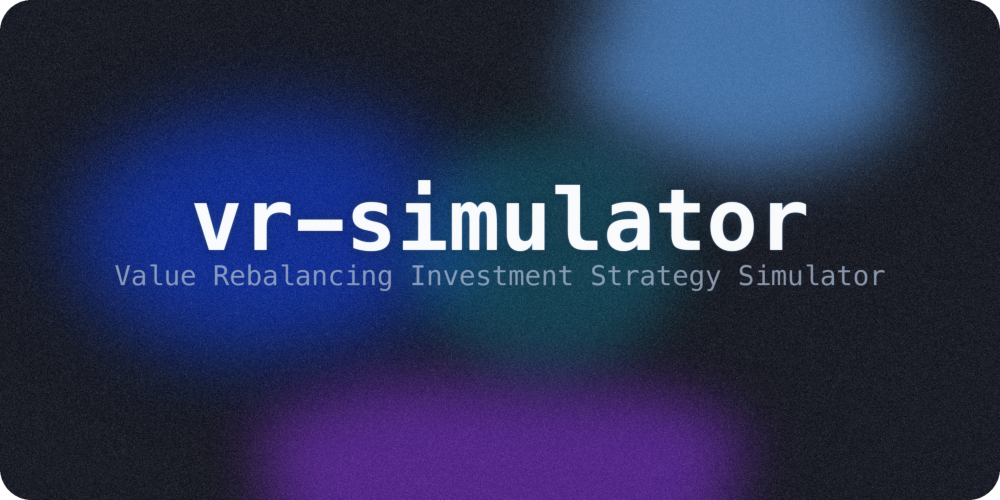

<p align="center"></p>

<h1 align="center">VR 시뮬레이터</h1>
<p align="center">
  <em>라오어 실력공식 기반 레버리지 ETF 밸류 리밸런싱 투자 시뮬레이터</em>
</p>
<p align="center">
  <a href="#-quick-start">Quick Start</a> · <a href="#-features">Features</a> · <a href="#-usage">Usage</a> · <a href="#-vr-formula">VR Formula</a>
</p>
<p align="center">
  <a href="https://github.com/wjgoarxiv/vr-simulator/stargazers"></a>
  <a href="./LICENSE"></a>
  <a href="https://www.python.org/"></a>
  <a href="./react_app"></a>
  <a href="#-v312-changes"></a>
</p>

---

> [!NOTE]
> 라오어의 실력공식을 기반으로 한 레버리지 ETF 밸류 리밸런싱(VR) 투자 시뮬레이터입니다. 사이클별 목표 가치(V), 적응형 밴드, 매수/매도 목표가를 자동 계산하고, V/E 괴리 보정과 비대칭 앵커링으로 현실적인 리밸런싱 전략을 지원합니다.

## 🌐 Live Demos

| 플랫폼 | URL |
|--------|-----|
| **Streamlit (V3.1.1)** | [vr-simulator.streamlit.app](https://vr-simulator.streamlit.app/) |
| **React (V3.2)** | [wjgoarxiv.github.io/vr-simulator](https://wjgoarxiv.github.io/vr-simulator/) |

## ✨ Features

- **실력공식 VR 계산** -- G 파라미터 기반 사이클별 목표 가치(V) 자동 계산
- **적응형 밴드** -- V/E 괴리율에 따른 밴드 자동 압축 (±15% ~ ±8%)
- **비대칭 앵커링** -- LBand는 V 기준, HBand는 min(V, E) 기준으로 매도 목표가 현실화
- **V/E Ratio Cap** -- V가 E의 115%를 초과하지 않도록 제한, 활성화 인디케이터 표시
- **인터랙티브 차트** -- Plotly 기반 4종 차트 (V/E 추이, 밴드, Pool, 매수/매도 테이블)
- **CSV 가져오기/내보내기** -- 사이클 기록 저장 및 불러오기, 유효성 검증 포함
- **KST 마켓 상태** -- 한국 시간 기준 미국 주식 시장 상태 + 예약 매매 시간대 표시
- **Bloomberg 다크 테마** -- 금융 터미널 스타일 UI

## 🚀 Quick Start

### Streamlit (Python)

```bash
pip install -r requirements.txt
streamlit run app.py
```

### React

```bash
cd react_app
npm install
npm run dev
```

## 📖 Usage

1. **설정** -- 사이드바에서 G값, 적립금, 적응형 밴드 ON/OFF, 티커명 설정
2. **시뮬레이션 시작** -- 초기 주가, 주식 수, Pool 입력 후 시작
3. **사이클 진행** -- 매 사이클 종료 시 현재가, 주식 수, Pool 입력 → 다음 사이클 V, 밴드, 목표가 자동 계산
4. **결과 분석** -- 차트 탭에서 V/E 추이, 밴드 변화, 매수/매도 테이블 확인 → CSV로 전체 기록 다운로드

## 📐 VR Formula

실력공식 (Value Rebalancing Formula):

```
V_f = V_i + (Pool / G) + ((E - V_i) / (2 * sqrt(G))) + Deposit
```

| 항목 | 설명 |
|------|------|
| `V_f` | 다음 사이클 목표 가치 |
| `V_i` | 이전 사이클 목표 가치 |
| `Pool` | 이전 사이클 종료 시 예수금 |
| `G` | 그라데이션 값 (권장: 10~20) |
| `E` | 이전 사이클 종료 시 평가금 (주식 수 x 가격) |
| `Deposit` | 다음 사이클 적립금 |

## 🔄 V3.1.2 Changes

1. **V/E Ratio Cap** -- V가 E의 115%를 초과하지 않도록 상한 제한
2. **비대칭 밴드 앵커링** -- LBand는 V 기준, HBand는 min(V, E) 기준
3. **밴드 반전 가드** -- HBand <= LBand 시 대칭 V 기반으로 폴백
4. **적응형 밴드 압축** -- V/E 괴리율 5%~50% 구간에서 밴드 폭 자동 조절
5. **V/E Cap 활성화 인디케이터** -- Cap 적용 여부를 UI에 표시
6. **CSV 스키마 확장** -- 적응형 밴드 상태 메타데이터 포함
7. **차트 개선** -- V/E 괴리 구간 시각화 및 밴드 비대칭 표시

## 🏗 Architecture

| 파일 | 설명 |
|------|------|
| `app.py` | 메인 Streamlit 앱 -- UI + VR 계산 로직 + 차트 (단일 파일) |
| `react_app/` | React 18 웹 앱 (GitHub Pages 배포) |
| `requirements.txt` | Python 의존성 |
| `Assets/` | 스크린샷 및 정적 자산 |

## 📦 Requirements

### Python

| 패키지 | 용도 |
|--------|------|
| `streamlit` | 웹 UI 프레임워크 |
| `numpy` | 수치 계산 |
| `scipy` | VR 공식 수학 함수 |
| `pandas` | CSV 처리 |
| `plotly` | 인터랙티브 차트 |
| `matplotlib` | PNG 차트 내보내기 |
| `pytz` | KST 시간대 변환 |

### React

| 패키지 | 용도 |
|--------|------|
| `react` 18 | UI 프레임워크 |
| `vite` | 빌드 도구 |

## 🤝 Contributing

기여를 환영합니다.

1. Fork the repository
2. Create a feature branch (`git checkout -b feature/my-feature`)
3. Commit your changes
4. Open a Pull Request

버그 리포트 또는 기능 요청은 [Issues](https://github.com/wjgoarxiv/vr-simulator/issues)에 등록해주세요.

## 📄 License

This project is licensed under the [MIT License](./LICENSE).
