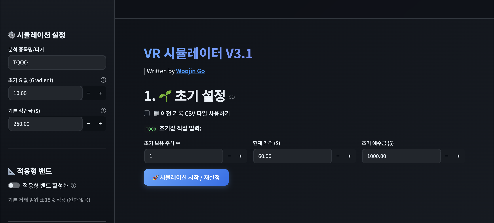
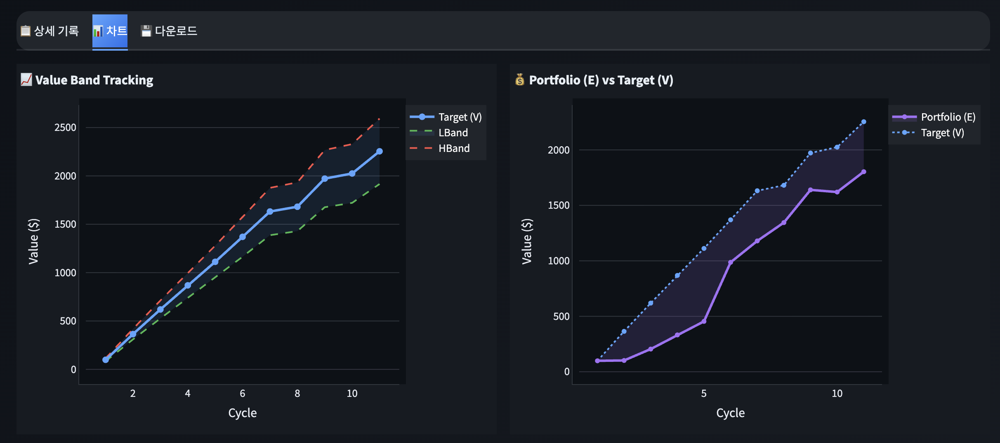

# VR 시뮬레이터 V3.1.2

Value Rebalancing 투자 전략 시뮬레이터

## 🌐 Live Demo

**Streamlit App**: [https://vr-simulator.streamlit.app/](https://vr-simulator.streamlit.app/)

## 🖼️ Screenshots

### Main Dashboard



### Charts & Analysis



## 🚀 실행 방법

```bash
pip install -r requirements.txt
streamlit run app.py
```

## 📊 핵심 기능

| 기능                    | 설명                                                         |
| ----------------------- | ------------------------------------------------------------ |
| **VR 공식 계산**        | 사이클별 목표 가치(V), 밴드(L/H), 매수/매도 임계가 자동 계산 |
| **CSV 업로드/다운로드** | 기존 사이클 기록 불러오기 및 전체 기록 저장                  |
| **차트 시각화**         | Plotly 인터랙티브 차트 + Matplotlib PNG 다운로드             |
| **마켓 상태**           | 한국 시간 기준 미국 주식 시장 상태 실시간 표시               |
| **적응형 밴드**         | V/E 괴리율에 따른 밴드 자동 압축 + 비대칭 앵커링 (아래 설명 참조) |

## 📐 VR 공식 (변형)

$$
V_f = V_i + \frac{pool_{prev}}{G} + \frac{(E - V_i)}{2\sqrt{G}} + deposit_{next}
$$

| 변수             | 설명                                        |
| ---------------- | ------------------------------------------- |
| $V_f$            | 다음 사이클 목표 가치                       |
| $V_i$            | 이전 사이클 목표 가치                       |
| $pool_{prev}$    | 이전 사이클 종료 시 예수금                  |
| $G$              | 그라데이션 값 (기본값: 10)                  |
| $E$              | 이전 사이클 종료 시 평가금 (주식 수 × 가격) |
| $deposit_{next}$ | 다음 사이클 적립금                          |

## 📈 매수/매도 규칙

```
매수 조건: E < LBand (평가금이 하단 밴드 이하)
매도 조건: E > HBand (평가금이 상단 밴드 이상)

LBand = V × 0.85 (기본)
HBand = V × 1.15 (기본)
```

## 🎯 적응형 밴드 (Adaptive Band)

### 개요

적응형 밴드는 목표 가치(V)와 실제 평가금(E)의 **괴리율**에 따라 밴드 폭을 자동으로 조절하는 기능입니다. 사이드바에서 ON/OFF 할 수 있습니다.

### 작동 원리

```
V/E 괴리율 5% 이하  → 기본 밴드 ±15% 유지 (압축 없음)
V/E 괴리율 5% 초과  → 밴드 폭 자동 압축 (최대 ±8%까지)
V/E 괴리율 50% 이상 → 최대 압축 (±8%)
```

괴리율이 클수록 밴드가 좁아져서 매수/매도 조건이 완화되고, 거래가 더 자주 발생합니다.

### 언제 켜야 하는가?

| 상황 | 적응형 밴드 | 이유 |
|------|------------|------|
| **적립금을 꾸준히 넣는 경우** | **ON (권장)** | 적립금이 V를 끌어올려 V > E 괴리가 누적됨. 밴드 압축 + 비대칭 앵커링이 매도 목표가를 현실적으로 유지 |
| **V/E 괴리율 5% 이상** | **ON (권장)** | 괴리가 큰 상태에서 기본 밴드(±15%)는 매도가 사실상 불가능. 압축으로 거래 가능성 확보 |
| **레버리지 ETF (TQQQ 등)** | **ON (권장)** | 변동성이 커서 V/E 괴리가 빈번. 압축이 리밸런싱 빈도를 적정 수준으로 유지 |
| **초기 몇 사이클 (V ≈ E)** | OFF 가능 | 괴리가 작을 때는 기본 밴드와 차이 없음 |
| **적립금 없이 운용** | OFF 가능 | V 성장이 완만하여 괴리 축적이 느림 |

> **요약**: 적립금을 넣으면서 10사이클 이상 운용한다면 **반드시 ON**을 권장합니다. 적응형 밴드를 끄면 V/E 괴리가 커질수록 매도 목표가가 비현실적으로 높아져, "매수만 하고 매도는 못하는" 상황이 발생할 수 있습니다.

## 🔧 V3.1.1 → V3.1.2 주요 보정

### V 성장 상한 (V/E Ratio Cap)

적립금(deposit)으로 인해 V가 E보다 과도하게 커지는 것을 방지합니다.

```
V ≤ E × 1.15 (V가 E의 115%를 초과하지 않도록 제한)
```

### 비대칭 밴드 앵커링 (Asymmetric Band Anchoring)

매수/매도 밴드에 서로 다른 기준값(anchor)을 적용하여, 매수 목표가는 보존하면서 매도 목표가만 현실적으로 낮춥니다.

```
LBand = compressed_lower × V         (매수: V 기준 → 매수 목표가 보존)
HBand = compressed_upper × min(V, E) (매도: min(V,E) 기준 → 매도 목표가 현실화)
```

| 상황 | 동작 |
|------|------|
| V ≈ E | 기존과 동일 (대칭) |
| V > E | 매도 밴드만 E 방향으로 하향 조정 |
| V < E | 기존과 동일 (양쪽 모두 V 기준) |

> **이론적 근거**: CPPI/TIPP 전략에서 floor과 cap을 서로 다른 기준값에 앵커링하는 학술적 선례에 기반합니다. Value Averaging 이론에서도 적립금으로 인한 target path 괴리 문제를 인식하고 있으며, 비대칭 허용대역은 정당한 리밸런싱 도구로 인정됩니다.

## 📚 참고

- [『미국주식 밸류 리밸런싱』](https://product.kyobobook.co.kr/detail/S000061695672)

## 📄 License

MIT License
